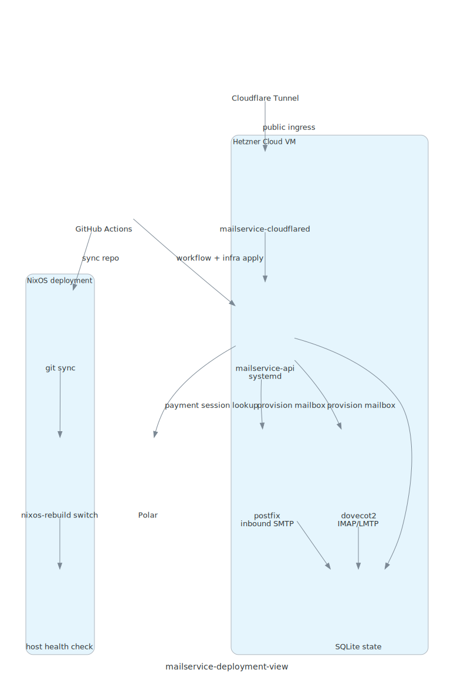

# Deployment View

Diagram source: `docs/architecture/diagrams/deployment_view.py`

## Current Production Shape

The current target is a single Hetzner host fronted by Cloudflare Tunnel for `truevipaccess.com`.

## Nodes

| Node | Role |
| --- | --- |
| GitHub Actions | Runs validation, OpenTofu plan/apply, and host deployment steps. |
| Hetzner Cloud VM | Main runtime host for the API and receive-only mail service. |
| Cloudflare Tunnel | Public HTTP ingress to the API without directly exposing the API port. |
| Polar | External payment system used during mailbox claim and payment confirmation. |

## Runtime Services On The Host

| Service | Purpose |
| --- | --- |
| `mailservice-api` | Main API systemd service built from the repo with Nix. |
| `postfix` | Receive-only SMTP ingress for inbound mail. |
| `dovecot2` | IMAP access and LMTP delivery for provisioned mailboxes. |
| `mailservice-cloudflared` | Temporary reverse-proxy ingress for `truevipaccess.com`. |
| SQLite database | Shared persistent state for API and mail runtime. |

## Deployment Flow

1. GitHub Actions validates the workflow and OpenTofu configuration.
2. GitHub Actions runs OpenTofu plan.
3. Production apply is gated behind the plan stage and environment approval.
4. For application changes, GitHub Actions syncs the repo revision to the host.
5. The host runs `nixos-rebuild switch --flake .#truevipaccess`.
6. GitHub Actions performs a host-local health check.

## Operational Constraints

- Cloudflare Tunnel is the current temporary ingress path, not the final permanent edge design.
- The app must keep `PUBLIC_BASE_URL` aligned with the public hostname so payment return URLs remain valid.
- The deployment docs and workflow should stay aligned with the NixOS host configuration.
