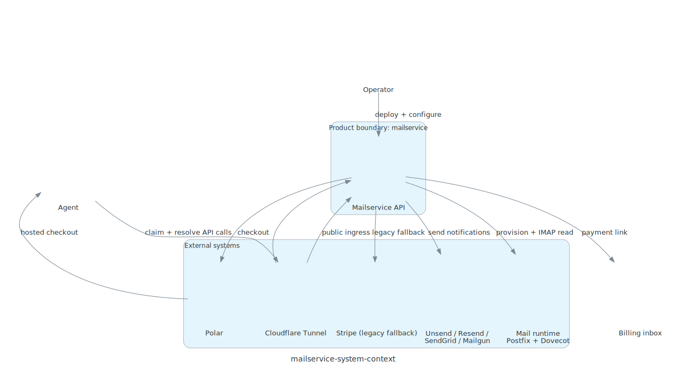

# System Context

Diagram source: `docs/architecture/diagrams/system_context.py`

## Purpose

`mailservice` sells inbound-only mailboxes bound to a cryptographic key.

The same key gets the same mailbox.
A different key gets a different mailbox.
`billing_email` is only the billing contact.

## Primary Actors

| Actor | Role |
| --- | --- |
| Agent | Claims a mailbox, pays, and later resolves mailbox access by proving control of the same key. |
| Billing inbox | Receives payment links and billing notices. |
| Operator | Deploys and configures the service. |

## External Systems

| System | Purpose |
| --- | --- |
| Polar | Checkout and payment session lookup for the preferred key-bound flow. |
| Stripe | Legacy payment fallback kept during migration. |
| Resend / SendGrid | Optional outbound notification delivery. |
| Mail runtime | Receive-only mail stack that stores incoming mail and exposes IMAP. |
| Cloudflare Tunnel | Temporary public ingress path for `truevipaccess.com`. |

## Core Relationships

1. Agent sends key proof plus `billing_email` to `mailservice`.
2. `mailservice` creates or reuses a mailbox for that key.
3. `mailservice` creates a payment session and sends the link to `billing_email`.
4. After payment, `mailservice` activates the mailbox and provisions it in the mail runtime.
5. Agent proves control of the same key to resolve IMAP access details.

## Product Boundary

Included:
- inbound mailbox creation
- payment-backed activation
- IMAP access resolution

Not included:
- SMTP submission
- outbound mail sending
- relay service
