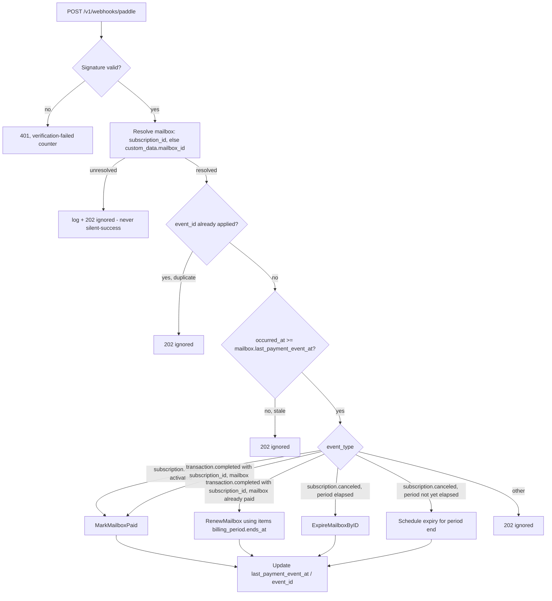

# Migrate Payment Provider from Polar to Paddle - Plan

## Goal Capsule

- **Objective:** Replace Polar with Paddle as the payment provider behind the existing `ports.PaymentGateway` seam — checkout/transaction creation, webhook-driven activation and renewal, claim-flow session reusability, gift coupons, the Pulse reporting pipeline, and admin observability — then delete Polar entirely.
- **Urgency:** Polar terminated the merchant account for this business (it could not reconcile the anonymous-mailbox product with its platform policies). This is not an optional hardening exercise — continued reliance on Polar for new checkouts may already be broken. Treat U9 (Paddle provisioning, including seller-account approval) as the first thing to start, not something sequenced comfortably behind other units.
- **Authority hierarchy:** This plan > `AGENTS.md` / `CONSTITUTION.md` conventions > implementer judgment on unstated details. Where this plan is silent, follow `CONSTITUTION.md` (hexagonal boundaries, `Err*` sentinels, strict JSON decoding, webhook signature verification, no CGO).
- **Execution profile:** Sequential, phased, but U2 wires Paddle into `cmd/app/main.go` as an *additive* branch alongside the still-live Polar and Stripe branches — Paddle and Polar coexist in the codebase through U1-U11 so each unit is independently testable. Polar deletion (U12) is the last phase and only proceeds once the rest is smoke-tested green, one real live-environment payment has completed successfully, and the legacy-subscriber notice has gone out.
- **Stop conditions:** Halt and flag rather than guess if: (a) Paddle's discount-rejection error shape (sandbox-verified in U7) doesn't distinguish invalid/exhausted/expired the way `isDiscountError` needs, *or* Paddle silently accepts a bad discount without applying it or erroring; (b) the live default payment link domain approval, or Paddle's seller/business-category approval, is still pending when other units are ready to integrate-test against live; (c) Paddle does not propagate transaction `custom_data` onto the subscription and onto renewal transactions (verify empirically in U9/U2 sandbox testing before U4 is considered complete — the entire renewal path depends on this); (d) no real live-environment payment has been completed end-to-end before U12 removes the working Polar path.
- **Tail ownership:** Implementer runs `go build ./...`, `go vet ./...`, and `go test ./... -race` before declaring any unit done, plus the smoke-test workflow specifically for U9 and U12; cleans up dead-end code from any abandoned Paddle error-mapping attempts before Definition of Done.

---

## Product Contract

### Summary

Full replacement of Polar with Paddle across checkout, subscription webhooks, the claim-flow session-reuse check, gift coupons, the Pulse digest, and admin metrics. Paddle account/product/discount/webhook provisioning is part of the work. Polar and Paddle coexist in the codebase through U1-U11 (additive `cmd/app/main.go` branch) so each unit ships independently testable; Polar code is deleted only in the final unit (U12), once Paddle is verified live. Existing Polar subscribers are not migrated — their renewals stop working once U12 lands, a deliberate accepted risk (see Risks & Dependencies), mitigated by a one-time notice rather than an active cancellation. Stripe (the existing legacy fallback) is untouched.

### Problem Frame

**Polar terminated the merchant account for this business.** Polar could not reconcile an anonymous, privacy-first inbound-mailbox product with its platform's underwriting model and canceled the account — this is the primary driver for this migration, not a preference between two working integrations. The engineering deficiencies in the current Polar adapter (`internal/adapters/payment/polar_gateway.go`, `internal/adapters/httpapi/polar_webhook.go`, `cmd/pulse`'s Polar client — hand-rolled REST with no official Go SDK, weak startup config validation, a webhook-secret-encoding compatibility hack) are real but secondary; they would not by themselves justify a twelve-unit migration, since each is fixable in place.

Because the account was terminated by Polar rather than wound down on this team's own schedule, the plan cannot assume Polar continues to behave normally for existing subscribers during the migration window — **verify the current state of the Polar account and its subscriptions (dashboard or API) before relying on any Polar-side behavior described below**, including whether checkout, webhooks, or renewals are still functioning at all.

Paddle offers an official Go SDK, granular scoped/rotatable/expiring API keys with GitHub secret scanning, a cleaner sandbox/live separation (separate accounts, key-prefix-encoded environment), and a richer native discount model — but it has no server-only hosted checkout on web, no `subscription.renewed` event, no idempotency keys, and unordered webhook delivery, each of which reshapes a piece of the current implementation rather than being a drop-in swap. Paddle is also, like Polar, a merchant of record that underwrites the seller and product category — its approval of this same anonymous-mailbox business model is not guaranteed and must be pursued early (see Risks & Dependencies).

### Requirements

**Checkout & subscriptions**
- R1. A mailbox claim that requires payment creates a Paddle transaction (`POST /transactions`) carrying `custom_data.mailbox_id` and `custom_data.owner_email`, and emails the resulting checkout link — the `checkout.url` Paddle returns on the transaction, not a URL the app constructs from configuration — to the user.
- R2. The emailed link opens a page on `truevipaccess.com` that loads Paddle.js and opens the checkout overlay via the transaction's `_ptxn` parameter — no server-only redirect exists on Paddle for web. The page renders visible fallback content (mailbox and price being purchased, a manual "Open payment window" button) so it is never a blank screen if the overlay fails to load, and handles a missing/invalid `_ptxn`, an already-completed transaction, and a declined/abandoned checkout as named states, not silent failures.
- R3. Mailbox activation (`MarkMailboxPaid`) is driven by webhook events — `subscription.created`/`subscription.activated` for the common case, or `transaction.completed` carrying a `subscription_id` when it is the *first* payment on a previously-unpaid mailbox (the routing logic checks paid state before deciding `MarkMailboxPaid` vs. `RenewMailbox`) — never by the client-side success page, which is UX confirmation only and must not claim the mailbox is active.
- R4. Subscription renewal extends `mailboxes.expires_at` on `transaction.completed` events carrying a `subscription_id`, resolving the target mailbox primarily by the stored Paddle `subscription_id` and falling back to `custom_data.mailbox_id` — verified empirically (see Goal Capsule stop condition (c)) that Paddle actually propagates `custom_data` onto renewal transactions before this fallback is relied upon.
- R5. Subscription cancellation (`subscription.canceled`) expires the mailbox (`ExpireMailboxByID`) only when the event indicates the current billing period has already elapsed; an immediate-effect or dunning-triggered cancellation mid-period does not revoke access the customer already paid for.
- R6. Webhook processing tolerates unordered, at-least-once, up-to-60-retry delivery: a webhook is deduplicated by its Paddle `event_id` (short-circuit to `202` on a repeat of the same event) and, independently, a webhook whose `occurred_at` is older than the target mailbox's last-applied payment event is ignored.

**Claim-flow session reuse**
- R7. `ClaimMailbox`'s existing session-reuse check (`paymentSessionReusable`) preserves its original behavior — `draft`/`ready` **and** `billed`/`paid`/`completed` (the port's open and succeeded statuses) are reusable; only `canceled` (the port's failed status) and 404 (`ErrPaymentSessionNotFound`) are not. This matches commit `e3e1600`'s original design intent, not a Paddle-driven inversion — see KTD1a for why a stricter "succeeded is not reusable" reading was considered and rejected. A `draft`/`ready` transaction older than a defined TTL is also treated as not reusable, since Paddle's checkout-URL validity window for an aging `ready` transaction is not guaranteed indefinite (deferred to follow-up — see Scope Boundaries).

**Gift coupons**
- R8. A configured gift coupon code (case-insensitive match) attaches the matching Paddle discount ID to a transaction and grants the configured number of months on successful payment, mirroring today's Polar-driven flow.
- R9. Coupon rejection (invalid, already used by this key, exhausted/expired) returns the same three error states the API contract already exposes today, now sourced from Paddle's discount-rejection response instead of a Polar 422 — and the gateway also detects the case where Paddle accepts the transaction without erroring but does not apply the discount, by comparing the returned transaction total against the expected discounted total.
- R10. `GrantedMonths` from a coupon extends `mailbox.ExpiresAt` by the granted period on both the no-account and account-linked `MarkMailboxPaid` branches (today only the no-account branch honors it). The account-linked branch's separate `account.SubscriptionExpiresAt` update continues to advance by exactly one billing period regardless of `GrantedMonths`, so a coupon on one mailbox never extends sibling mailboxes on the same account.

**Data model**
- R11. `mailboxes.stripe_session_id` is renamed to `payment_session_id` (a metadata-only `ALTER TABLE ... RENAME COLUMN`, not a table rebuild) and a `payment_provider` column is added, correctly discriminating pre-existing Stripe rows from Polar rows by session-ID prefix (Stripe checkout session IDs start with `cs_`; Polar's do not) rather than by mere non-emptiness — needed because the legacy-subscriber notice (Documentation / Operational Notes) must identify genuine Polar subscribers without misidentifying active Stripe customers.
- R12. `mailboxes` gains a `subscription_id` column (Paddle subscription ID, nullable) and a `last_payment_event_at` timestamp column, populated by U4's webhook handling and used as the primary renewal join key and the ordering-guard baseline respectively.

**Pulse & admin observability**
- R13. `cmd/pulse` reports subscription counts from Paddle using a read-only, separately-scoped token, an explicit status filter (not the default active-only filter), and a configurable base URL (sandbox vs. live).
- R14. `GET /admin/metrics` gains counters for payment link creation, session lookups, webhook receipts (per handled event type, from a bounded set — not one counter per arbitrary Paddle event name), webhook verification failures, and discount rejections, actually emitted through the registry's `Snapshot()` output.

**Provisioning & teardown**
- R15. Paddle product, price, discount, seller-account, and webhook notification destination are provisioned (sandbox and live) as part of this work, including submitting the live default-payment-link domain and the seller/business-category approval for Paddle's review as early as possible.
- R16. All Polar code, config, CI/CD references, ops scripts, and architecture docs are removed, with a pre-flight `secrets.POLAR` reference sweep before deleting any GitHub secret.

### Scope Boundaries

**In scope:** everything in Requirements above — checkout, subscriptions, renewal webhooks, claim-flow live-validation, gift coupons, Pulse, admin metrics, Paddle provisioning, Polar removal.

**Out of scope / non-goals:**
- Stripe stays exactly as-is (`stripe_gateway.go`, `handleStripeWebhook`, the `cmd/app/main.go` provider-selection chain's Stripe branch). Not touched, not evaluated for removal.
- Multi-item Paddle subscriptions bundling several mailboxes under one owner into a single subscription — the existing model (one payment session per mailbox, multiple subscriptions per owner) is preserved. Paddle supports multi-item subscriptions, but nothing in the current architecture stores a cross-mailbox subscription object, and introducing one is a separate, larger change.
- Actively canceling existing Polar subscriptions via the Polar API. Explicitly decided against — the mitigation for legacy subscribers is a one-time notice, not an active cancellation. See Risks & Dependencies for the consequence this accepts.
- A permanent dormant Polar renewal-only fallback. Explicitly rejected — Polar code is fully deleted in U12.

#### Deferred to Follow-Up Work
- A per-code (rather than single-shared-code) gift coupon system, if ever wanted, is a separate feature — this plan only ports today's single-code-single-discount design to Paddle.
- Creating `docs/solutions/integration-issues/polar-to-paddle-migration.md` and a root `CONCEPTS.md` after this ships (the learnings-research agent flagged both absences as worth fixing, but they're documentation follow-up, not implementation).
- Splitting the config-validation hardening, `GrantedMonths` account-linked-branch fix, and Pulse status-filter/base-URL fixes out into a Polar-targeted patch that could ship independently of the provider swap was considered (product-lens review) and rejected: Polar's account is already terminated, so a Polar-targeted patch has no runway to matter before this migration supersedes it.
- R7's session-age TTL check (a `draft`/`ready` transaction older than 24h treated as not reusable) was descoped from U5 during implementation. The only in-scope proxy for session age (`mailbox.UpdatedAt`) fails silently in the direction that matters — if any other code path calls `repo.Update` on a still-pending mailbox for an unrelated reason, the TTL would never fire, quietly reintroducing the dead-URL risk this check exists to prevent. The correct fix adds a real creation-timestamp field to `ports.PaymentSession`, populated by each gateway (Polar, Stripe, Paddle, Mock) — a small but port-level change outside U5's Files list, warranting its own reviewed unit rather than an unverified workaround.

---

## Planning Contract

### Key Technical Decisions

- **KTD1a — `paymentSessionReusable` does NOT overwrite `PaymentSessionID` for a succeeded session, even though a fresh Paddle transaction on reclaim was the original R7 wording.** During U5's implementation, a straight whitelist inversion (reusable only for open/pending, mint fresh on succeeded) was built to match this plan's literal original R7 text — and caught by code review as a genuine regression: `ClaimMailbox`/`MarkMailboxPaid` join on `PaymentSessionID`, so minting a fresh session for an already-succeeded one overwrites it, and an in-flight webhook for the original session can no longer find the mailbox when it lands — a silent, orphaned successful payment. Commit `e3e1600` (the precedent this plan cites throughout) deliberately treated a succeeded session as reusable specifically to avoid this race; the plan's original R7 mis-specified the fix by analogy to Paddle's status *names* without re-deriving from why `e3e1600`'s design looked the way it did. Corrected: only `canceled` (terminal-failed) and 404 trigger a fresh session; `draft`/`ready`/`billed`/`paid`/`completed` are all reusable, matching original behavior. A mailbox stuck with a succeeded session that never got activated (webhook permanently lost, not just delayed) stays pending rather than self-healing via session regeneration — accepted as a rare case fixable by manual reconciliation, not by blind regeneration that reopens the orphan race for the common case.
- **KTD1 — Reuse the existing `PaymentGateway` port unchanged.** `internal/core/ports.PaymentGateway` (`CreatePaymentLink`, `GetPaymentSession` over `PaymentLinkRequest`/`PaymentSession`) is already provider-neutral and needs no new methods. `PaddleGateway` implements it the same way `PolarGateway` and `StripeGateway` do; `cmd/app/main.go`'s provider-selection chain gains a Paddle branch **additive** to the existing Polar and Stripe branches (all three coexist through U1-U11), passed through wherever `StripeWebhookSecret`-shaped config already reaches the HTTP handler, and gift-coupon wiring (`giftOpts`) is re-gated to check for Paddle config presence alongside the existing Polar check.
- **KTD2 — Full deletion in U12, coexistence until then; no forced Polar-subscriber migration.** Polar and Paddle run side by side through U1-U11 so units land and are individually testable without a big-bang cutover. U12 deletes Polar entirely — no permanent dormant fallback. Existing Polar subscribers are not actively migrated or canceled; their renewals stop working once U12 lands. This is an accepted risk given Polar has already terminated the account (see Problem Frame) — mitigated only by a one-time operational notice, not by code or an active Polar-side cancellation.
- **KTD3 — Rename `stripe_session_id` to `payment_session_id`; add `payment_provider` and `subscription_id`.** The session-ID column has already survived two provider generations under a misleading name; renaming it is a metadata-only `ALTER TABLE ... RENAME COLUMN` on SQLite/libSQL, not a table rebuild, so it carries little of the risk a full migration would. `payment_provider` is needed (not speculative) because the legacy-subscriber notice must distinguish genuine Polar rows from Stripe rows that share the same column — backfill by session-ID prefix (`cs_%` → `stripe`, else → `polar`), not by mere non-emptiness. `subscription_id` is the primary renewal join key (see KTD6); `custom_data.mailbox_id` is the fallback, not the reverse.
- **KTD4 — Checkout page is server-served with real failure states, not a content-free shell.** The emailed link points at a page on `truevipaccess.com` (not a client SPA) that includes Paddle.js and lets it auto-detect `_ptxn` from the query string, but the page itself renders fallback content and handles script-load failure, missing/invalid `_ptxn`, an already-completed or canceled transaction (server-side status check before rendering, redirecting to the success page or a "link no longer valid" page as appropriate), and a declined/abandoned checkout (`checkout.error`/`checkout.closed` Paddle.js events surface an inline retry affordance). The success page's copy is provisional ("payment received, activating your mailbox") — it never claims the mailbox is active, since activation is webhook-driven and asynchronous.
- **KTD5 — Webhook idempotency via both `event_id` dedup and an `occurred_at` ordering guard, applied after mailbox resolution.** A new `last_payment_event_at` column (and a `last_payment_event_id` column) on `mailboxes` are compared against each webhook before applying a state change — `event_id` catches identical redelivery via a direct identity check (evaluated first, before the timestamp comparison); `occurred_at` catches genuine out-of-order delivery of *different* events, and — via its equal-timestamp rejection rule — would independently also reject an identical-timestamp retry on its own. `RenewMailbox` assigns `mailbox.ExpiresAt` as an absolute value (a set, taking the later of the incoming and current expiry — see the final-review fix for the `GrantedMonths` interaction), **not additively**; the corrected concern is not that a retry would compound `expires_at`, but that without either guard a redelivered event would silently re-apply the same renewal (and its side effects, e.g. `RecordPaymentEvent`) a second time for no reason. The two checks are deliberately redundant defense-in-depth for that case, not each covering a distinct failure mode. Both checks run **after** the mailbox is resolved from the event (by `subscription_id` or `custom_data.mailbox_id`), not before — the guard's baseline is a per-mailbox column and cannot be evaluated without knowing which mailbox.
- **KTD6 — `transaction.completed` (not a `subscription.*` event) is the renewal signal; first-payment activation is a distinct branch of the same event.** Paddle has no `subscription.renewed` event; renewals arrive as `transaction.completed` carrying `subscription_id`. Because a *first* payment can also produce `transaction.completed`, the routing logic checks whether the resolved mailbox is already paid before choosing `MarkMailboxPaid` (not yet paid) vs. `RenewMailbox` (already paid) — `RenewMailbox`'s `expiresAt` argument is derived from the transaction's `items[].billing_period.ends_at`, and `MarkMailboxPaid`'s session-ID argument from the subscription event's `transaction_id` field. When `custom_data.mailbox_id` is absent and no `subscription_id` match resolves the mailbox either, the handler fails loud (log + `202`-ignored, never silently succeed) — this is the exact defect class fixed in `b8d7d54` for Polar, now guarded against for a differently-shaped event, and it is a Goal Capsule stop condition that Paddle's `custom_data` propagation onto renewals is verified empirically before this unit is considered complete.
- **KTD7 — `subscription.canceled` maps to `ExpireMailboxByID` only when the current billing period has elapsed.** Paddle's own cancellation default is period-end via `scheduled_change`, and most `subscription.canceled` webhooks will indeed arrive after the customer's paid period has ended — but immediate-effect cancellations and involuntary dunning cancellations can fire before then. The handler checks the event payload's period-end information rather than assuming every `subscription.canceled` webhook is safe to act on immediately; when the period hasn't elapsed, expiry is scheduled for the period end instead of applied immediately.
- **KTD8 — Discount-rejection mapping is verified empirically, not assumed — including the silent-acceptance branch.** Paddle's discount error shape is a structured `error.code` on a `4xx` response, not Polar's bare `422`, and the plan cannot state the exact code without a live sandbox call. The untested and worse branch is Paddle accepting the transaction without applying the discount at all — U7's gateway compares the returned transaction total against the expected discounted total and treats a mismatch as a discount-rejection, not a silent full-price charge.
- **KTD9 — Startup config validation is stricter than Polar's, and covers both server and client-facing credentials.** Polar's `config.Load()` never hard-validated its env vars; a partial config silently fell through to Stripe/mock. Paddle's config hard-validates at startup: the server-side API key's `pdl_(live|sdbx)_apikey_...` prefix must match `PADDLE_ENVIRONMENT`, and the client-side `PADDLE_CLIENT_TOKEN` must match Paddle's client-token shape (not the API-key shape) — closing both the class of mismatch that caused the smoke-environment Polar token incident and the risk of a server secret being pasted into the public-facing client-token slot.
- **KTD10 — Pulse gets its own read-only Paddle key and a configurable base URL.** Mirrors the existing `POLAR_PULSE_TOKEN` / `POLAR_TOKEN` split, but fixes two latent bugs found in the Polar pulse client: a hardcoded API base URL (breaks sandbox testing) and reliance on the default active-only status filter (undercounts subscriptions, the same failure shape behind the previously-observed Polar/mailbox billing drift).
- **KTD11 — Provisioning-time secrets are pinned to minimum scope and never echoed.** The app's primary `PADDLE_API_KEY` is created with only the permissions the app actually calls (`transaction.write`, `transaction.read`, `subscription.read`, `discount.read` — no customer write, no refund, no product/price write); U9's provisioning script writes retrieved secrets (webhook `endpoint_secret_key`, API keys) directly to their destination GitHub environment secrets and never prints them to stdout/CI logs.
- **KTD12 — The checkout and success pages carry a restrictive CSP and validate their inputs.** U6's pages run third-party Paddle.js on the primary domain; a `Content-Security-Policy` header pins `script-src` to `self` plus Paddle's documented CDN origin. The success route validates `txn_id` against Paddle's `txn_[a-z0-9]+` shape and renders via `html/template`, never string concatenation, before reflecting it.

### High-Level Technical Design

**Checkout & activation sequence:**

```mermaid
sequenceDiagram
    participant U as User
    participant App as mailservice API
    participant Email as Notifier
    participant Page as Paddle.js page
    participant Paddle as Paddle API

    U->>App: POST /v1/mailboxes/claim
    App->>Paddle: POST /transactions (custom_data.mailbox_id)
    Paddle-->>App: txn_id, checkout.url (?_ptxn=txn_id)
    App->>Email: send payment link (Paddle's checkout.url)
    Email-->>U: email with link to Page?_ptxn=txn_id
    U->>Page: opens link
    Page->>App: server-side status check on txn_id
    App-->>Page: draft/ready -> render checkout; completed -> redirect success; canceled -> "link no longer valid"
    Page->>Paddle: Paddle.js reads _ptxn, opens overlay (fallback content behind it)
    U->>Paddle: completes payment (or declines/abandons -> inline retry state)
    Paddle-->>App: webhook: transaction.completed / subscription.created
    App->>App: verify signature, dedupe event_id, resolve mailbox, check occurred_at, activate/renew
    Paddle-->>Page: client-side checkout.completed (UX only)
    Page-->>U: success page (provisional copy, no mutation)
```

**Webhook event routing:**



### Assumptions

- Paddle propagates transaction `custom_data` onto the subscription and onto renewal transactions — unverified until sandbox-tested (Goal Capsule stop condition (c)); if false, `subscription_id`-based resolution (R4, KTD3) becomes the sole join key and `custom_data.mailbox_id` must instead be set on the subscription directly at creation time, which is an execution-time design change, not something this plan can pre-resolve without sandbox access.
- The exact Paddle discount-rejection error code/type (KTD8) is unknown until sandbox-verified in U7 — treated as an execution-time discovery, not a planning-time fact.
- `MAILBOX_PRICE_CENTS` (100, i.e. 1 EUR) vs. the `299` figure in env templates: **this is a pricing decision, not an implementation detail** — the product owner must confirm which figure is authoritative before U9 creates the live Paddle price, since the price becomes immutable once transactions reference it. Treated as a stop-condition-adjacent blocker on U9's live half, not something the implementer resolves unilaterally.
- The `smoke-test-periodic.yml` workflow's trigger (cron vs. `workflow_call`-only) affects how much regression coverage this migration gets automatically — U12 adds an explicit `workflow_dispatch` trigger regardless, so the Verification Contract's gate is executable either way.
- The count of active, non-expired Polar subscriptions (and the revenue they represent) is unknown at planning time — U9 or U12 queries the Polar dashboard/API for this count early, since it sizes the blast radius of the KTD2 accepted risk and should inform whether the notice-only mitigation remains the right call as the number becomes concrete.

---

## Implementation Units

### Unit Index

| U-ID | Title | Files touched | Depends on |
|---|---|---|---|
| U1 | Paddle SDK + config scaffolding | `go.mod`, `internal/platform/config/config.go` | — |
| U2 | PaddleGateway adapter + main.go wiring | `internal/adapters/payment/paddle_gateway.go`, `cmd/app/main.go` | U1, U9 (sandbox default payment link) |
| U3 | Paddle webhook signature verification | `internal/adapters/httpapi/paddle_webhook.go` | U1, U9 |
| U4 | Webhook event routing, renewal, ordering + dedup | `internal/adapters/httpapi/handler.go`, migration | U2, U3, U8 |
| U5 | Claim-flow live-validation fix | `internal/core/service/mailbox_service.go`, `paddle_gateway.go` | U2 |
| U6 | Paddle.js checkout page with failure states | `internal/adapters/httpapi/handler.go`, notify templates | U2, U9 |
| U7 | Gift coupons on Paddle | `internal/core/service/mailbox_service.go`, `paddle_gateway.go`, `config.go` | U2 |
| U8 | DB schema: rename + provider + subscription_id + event columns | migrations, `mailbox_gorm.go`, `mailbox.go` | — |
| U9 | Paddle provisioning (product/price/discount/seller/webhook/domain) | `ops/paddle-setup.sh` | — |
| U10 | Pulse pipeline migration | `cmd/pulse/main.go` | U1, U9 |
| U11 | Admin metrics counters | `internal/platform/metrics/metrics.go`, gateway/webhook/handler/service files | U2, U3, U4 |
| U12 | Remove Polar entirely | many (see unit) | U1–U10 (U11 lands independently; not a cutover blocker) |

---

### U1. Paddle SDK dependency and config scaffolding

**Goal:** Bring in the official Paddle Go SDK and add hard-validated Paddle configuration, closing the weak-validation gap that let partial Polar config fail silently.

**Requirements:** R15 (partially — config prerequisite), KTD9

**Dependencies:** None

**Files:**
- `go.mod`, `go.sum`
- `internal/platform/config/config.go`
- `internal/platform/config/config_test.go`

**Approach:** `go get github.com/PaddleHQ/paddle-go-sdk/v5`. Add `PADDLE_API_KEY`, `PADDLE_WEBHOOK_SECRET`, `PADDLE_PRICE_ID`, `PADDLE_DEFAULT_PAYMENT_LINK_URL`, `PADDLE_CLIENT_TOKEN`, `PADDLE_ENVIRONMENT` (`sandbox`/`live`), `PADDLE_GIFT_DISCOUNT_ID`, `PADDLE_GIFT_COUPON_CODE` to `config.go`. Unlike Polar's `if cfg.PolarToken != "" && cfg.PolarProductID != ""` soft check, validate at `config.Load()`: all required fields present when Paddle is the active provider; the API key's `pdl_(live|sdbx)_apikey_...` prefix matches `PADDLE_ENVIRONMENT`; and `PADDLE_CLIENT_TOKEN` matches Paddle's client-token shape (`live_`/`test_` prefix) rather than the API-key shape, failing startup if a server key was pasted into the client-token slot. Fail startup with a clear error on any mismatch, per `CONSTITUTION.md` ARCH-005 (config load once at startup).

**Patterns to follow:** `internal/platform/config/config.go:127-134` (existing `POLAR_*` var reading) for shape; the learnings-research finding on the `EDPROOF_HMAC_SECRET` config-drift incident for what "add to config + validate" actually requires downstream (deploy workflow env generation, mapping, validation list — carried in U12/U9, not duplicated here).

**Test scenarios:**
- Happy path: all `PADDLE_*` vars set correctly, environment matches key prefix → `config.Load()` succeeds.
- Missing `PADDLE_API_KEY` with Paddle selected as active provider → startup fails with a named error, not a silent fallback.
- Key prefix `pdl_sdbx_...` with `PADDLE_ENVIRONMENT=live` → startup fails (mismatch caught).
- Key prefix `pdl_live_...` with `PADDLE_ENVIRONMENT=sandbox` → startup fails (mismatch caught).
- `PADDLE_CLIENT_TOKEN` set to an API-key-shaped value (`pdl_*_apikey_...`) → startup fails (wrong credential in the client-token slot).

**Verification:** `go build ./...` succeeds; `go test ./internal/platform/config/...` passes.

---

### U2. PaddleGateway adapter and provider-chain wiring

**Goal:** Implement `ports.PaymentGateway` against Paddle's Transactions API and wire it into `cmd/app/main.go` as an additive branch, so it is reachable and testable before Polar is removed.

**Requirements:** R1, R7 (status-mapping half), R9 (silent-acceptance detection)

**Dependencies:** U1; U9's sandbox default payment link must exist before this unit's tests can exercise a real `checkout.url` (httptest-mocked unit tests don't need it, but sandbox integration verification does)

**Files:**
- `internal/adapters/payment/paddle_gateway.go`
- `internal/adapters/payment/paddle_gateway_test.go`
- `cmd/app/main.go` (Paddle branch in the provider-selection chain, additive alongside Polar and Stripe; wire `PADDLE_WEBHOOK_SECRET` into the Handler config the same way `StripeWebhookSecret` already reaches it)

**Approach:** `CreatePaymentLink` → `POST /transactions` with `items: [{price_id, quantity: 1}]`, `custom_data: {mailbox_id, owner_email}`, `discount_id` when a coupon is present; read `checkout.url` from the response, returning a named error (not an empty-URL `PaymentLink`) when `checkout.url` is null or absent. `GetPaymentSession` → `GET /transactions/{id}`; 404 maps to `ports.ErrPaymentSessionNotFound` (unchanged sentinel). `mapPaddleStatus` maps `draft`/`ready` → the port's open/pending status, `billed`/`paid`/`completed` → succeeded, `canceled` → failed. `isDiscountError`-equivalent inspects Paddle's structured `error.code` (exact codes confirmed empirically in U7) to distinguish invalid/exhausted/expired discounts, and separately compares the transaction's actual total against the expected discounted total to catch Paddle silently not applying a discount.

**Technical design:** Mirror `polar_gateway.go`'s `PolarConfig{ServerURL, Token, ProductID, ..., Client}` shape as `PaddleConfig{BaseURL, APIKey, PriceID, DefaultPaymentLinkURL, Client}` — directional, not a literal port; use the SDK's typed client where it covers the call, drop to raw REST only where the SDK doesn't (if at all).

**Patterns to follow:** `internal/adapters/payment/polar_gateway.go` structure (`doJSON` helper equivalent, sentinel error mapping, `Client *http.Client` injection point for tests). `internal/adapters/payment/polar_gateway_test.go`'s `httptest.NewServer` pattern — mirror exactly for `paddle_gateway_test.go`. `cmd/app/main.go:74-100`'s existing Polar branch for the shape of the new Paddle branch.

**Test scenarios:**
- `CreatePaymentLink` with a valid price ID returns a checkout URL containing `_ptxn=`.
- `CreatePaymentLink` with a discount ID includes `discount_id` in the request body.
- `CreatePaymentLink` where the response has a null/empty `checkout.url` returns a named error, not a `PaymentLink` with an empty URL.
- `GetPaymentSession` maps each of `draft`, `ready`, `billed`, `paid`, `completed`, `canceled` to the correct port status.
- `GetPaymentSession` on a 404 response returns `ErrPaymentSessionNotFound`.
- A discount-rejection response (mocked via `httptest`) returns the mapped coupon error.
- A response where the discount was silently not applied (total mismatches expected discounted total) returns a coupon error, not a success.
- A 5xx or timeout response returns a wrapped error, not a panic or silent empty result.
- `cmd/app/main.go` constructs `PaddleGateway` when Paddle config is present, alongside (not instead of) the existing Polar/Stripe construction — a regression test confirms Polar and Stripe branches are unaffected.

**Verification:** `go test ./internal/adapters/payment/... -run Paddle -v`; `go build ./...`.

---

### U3. Paddle webhook signature verification

**Goal:** Verify `Paddle-Signature` headers against the raw request body before any event processing.

**Requirements:** R6 (prerequisite), KTD5

**Dependencies:** U1, U9 (webhook destination and its `endpoint_secret_key` must be provisioned to test against a real secret; unit tests can use a synthetic secret independently)

**Files:**
- `internal/adapters/httpapi/paddle_webhook.go`
- `internal/adapters/httpapi/paddle_webhook_test.go`

**Approach:** Use the Paddle Go SDK's webhook verifier (`paddle.NewWebhookVerifier`) against the raw request body rather than hand-rolling HMAC parsing — the SDK is a stated reason for choosing Paddle, and reimplementing a security-critical primitive by hand reproduces the exact hand-rolled-fragility class this migration moves away from. Keep two local concerns the SDK doesn't own: the request body-size cap (`io.LimitReader`, matching the existing Polar pattern) applied before the verifier reads the body, and fail-closed behavior when `PADDLE_WEBHOOK_SECRET` is unconfigured (a state U1's startup validation makes unreachable in production, but still worth a defensive test).

**Patterns to follow:** `internal/adapters/httpapi/polar_webhook.go`'s body-size cap — but do **not** port its signature-parsing logic or its dual base64/raw secret-encoding hack (`polar_webhook.go:68-71`); the SDK verifier replaces both.

**Test scenarios:**
- Valid signature → accepted (via the SDK verifier).
- Bad signature → rejected.
- `ts` older than the SDK's replay tolerance → rejected.
- Malformed or missing `Paddle-Signature` header → rejected with a clear error, not a panic.
- Handler constructed with an empty webhook secret (unreachable in production because U1's startup validation requires it, tested here as defense-in-depth) → fails closed rather than accepting any signature.
- Request body exceeding the size cap is rejected before signature verification runs.

**Verification:** `go test ./internal/adapters/httpapi/... -run Paddle -v`.

---

### U4. Webhook event routing, activation, renewal, and idempotency

**Goal:** Route verified Paddle webhook events to the right mailbox state transitions, correctly distinguishing first-payment activation from renewal, and guarding against both out-of-order and duplicate delivery.

**Requirements:** R3, R4, R5, R6, R12 (schema)

**Dependencies:** U2, U3, U8

**Files:**
- `internal/adapters/httpapi/handler.go`
- `internal/platform/database/migrations/<timestamp>_add_mailbox_payment_tracking_columns.sql` (or reuse U8's migration if landed first — see U8)
- `internal/adapters/repository/mailbox_gorm.go`
- `internal/domain/mailbox.go`

**Approach:** Register `POST /v1/webhooks/paddle` → `handlePaddleWebhook`. After signature verification, resolve the target mailbox first — by stored `subscription_id` when the event carries one, falling back to `custom_data.mailbox_id` — before any ordering or dedup check runs (both `last_payment_event_at` and `last_payment_event_id` are per-mailbox columns and cannot be compared without knowing the mailbox). If the mailbox cannot be resolved, log and return `202 {"status":"ignored"}` — never silently succeed. If resolved, check `event_id` against the mailbox's `last_payment_event_id` first (exact-duplicate redelivery short-circuits to `202`, since `RenewMailbox` is additive and a same-timestamp retry would otherwise double-grant a billing period), then check `occurred_at` against `last_payment_event_at` (stale, out-of-order events are ignored). Route: `subscription.created`/`subscription.activated`, or `transaction.completed` on a not-yet-paid mailbox, → `MarkMailboxPaid` (session-ID argument from the event's `transaction_id` field); `transaction.completed` with `subscription_id` on an already-paid mailbox → `RenewMailbox` (`expiresAt` argument from `items[].billing_period.ends_at`); `subscription.canceled` where the payload indicates the current period has elapsed → `ExpireMailboxByID`, otherwise schedule expiry for period end rather than acting immediately; everything else → `202 ignored`. Update `last_payment_event_at`/`last_payment_event_id` on every applied change.

**Execution note:** Characterization-test the existing `handleSubscriptionRenewal`, `handleSubscriptionCancellation`, and `handleSubscriptionRevocation` call sites (`internal/adapters/httpapi/handler.go`) before changing their trigger conditions — this unit changes *what* calls them, not their internals, and a characterization pass catches unintended behavior drift. Coordinate migration ordering with U8: both units add columns to `mailboxes` and touch `mailbox_gorm.go`/`mailbox.go` — land U8 first (it declares no dependencies) so this unit's migration and struct edits build on top of it rather than racing it.

**Patterns to follow:** `internal/adapters/httpapi/handler.go:1197-1210` event-routing table shape; `handler.go`'s `coalesceNow`/injectable `now func() time.Time` pattern for testable timestamp comparisons.

**Test scenarios:**
- `subscription.created` on a not-yet-paid mailbox → `MarkMailboxPaid` called with the session ID from `transaction_id`.
- `transaction.completed` with `subscription_id` on a not-yet-paid mailbox → `MarkMailboxPaid` called, not `RenewMailbox`.
- `transaction.completed` with `subscription_id` on an already-paid mailbox → `RenewMailbox` called with `expiresAt` derived from `items[].billing_period.ends_at`.
- `transaction.completed` where the mailbox cannot be resolved by `subscription_id` or `custom_data.mailbox_id` → `202 ignored`, no mutation, logged.
- `subscription.canceled` where the payload's period has elapsed → mailbox expired immediately.
- `subscription.canceled` where the payload's period has not yet elapsed → expiry scheduled for period end, mailbox not immediately revoked.
- A webhook with `occurred_at` older than the mailbox's `last_payment_event_at` → ignored, state unchanged.
- The exact same event (`event_id`) delivered twice → the second delivery is a no-op (short-circuited on `event_id`, not merely "idempotent by luck") — `expires_at` is not double-extended.
- An unrecognized `event_type` → `202 ignored`.

**Verification:** `go test ./internal/adapters/httpapi/... -run PaddleWebhook -v`; `go test ./internal/adapters/httpapi/... -run Handler` (regression on existing handler tests).

---

### U5. Claim-flow live-validation fix

**Goal:** Confirm `paymentSessionReusable` (`internal/core/service/mailbox_service.go:220`) still implements its original, correct behavior under Paddle — reusable for `draft`/`ready`/`billed`/`paid`/`completed` (the port's open and succeeded statuses), not reusable only for `canceled` (the port's failed status) or a 404 (`ErrPaymentSessionNotFound`) — and lock that in with regression tests. This unit's original scoping (in an earlier plan draft) proposed inverting the function to reject `Succeeded` sessions; that proposal was corrected mid-execution (see R7 and KTD1a) once code review caught it reintroducing the exact orphaned-payment race `e3e1600` fixed for Polar, in the opposite direction from what this unit originally assumed. This is **verification-only** for `mailbox_service.go` itself — the corrected understanding is that the function needs no code change, only test coverage confirming it.

**Requirements:** R7, KTD1a

**Dependencies:** U2

**Files:**
- `internal/core/service/mailbox_service.go` (`paymentSessionReusable`, confirmed unchanged from pre-migration — no diff)
- `internal/core/service/mailbox_service_test.go` (regression tests for the corrected behavior)
- `internal/adapters/payment/stripe_gateway_test.go` (regression — `paymentSessionReusable` is shared with Stripe, so this confirms Stripe's reusability behavior is also unaffected)

**Approach:** Verify `paymentSessionReusable` treats `Expired`/`Failed` (and 404 via `ErrPaymentSessionNotFound`) as not reusable, and every other status — `Open`, `Succeeded`, `Confirmed` — as reusable, matching `e3e1600`'s original design intent. A succeeded session must stay reusable: `ClaimMailbox`/`MarkMailboxPaid` join on `PaymentSessionID`, so minting a fresh transaction for an already-succeeded one would overwrite it and orphan an in-flight webhook for the original session (see KTD1a). Add regression tests locking in this behavior so a future change can't silently re-invert it.

**Patterns to follow:** Existing `paymentSessionReusable` tests in `mailbox_service_test.go`; the port's status enum in `internal/core/ports/ports.go`.

**Test scenarios:**
- Existing pending mailbox with a Paddle session in the open/pending status → reused, no new transaction created.
- Existing pending mailbox with a Paddle session in the succeeded status → reused, no new transaction created (this is the case the earlier, corrected unit scoping got wrong).
- Existing pending mailbox with a Paddle session in a failed/canceled status → not reused, fresh transaction minted.
- Existing pending mailbox whose session returns 404 → not reused, fresh transaction minted.
- Stripe gateway regression: existing Stripe-backed pending mailbox reusability behavior is unchanged (same shared service-layer function, different gateway).

**Verification:** `go test ./internal/core/service/... -run Claim -v`; `go test ./internal/adapters/payment/... -run Stripe -v`.

---

### U6. Paddle.js checkout page with failure states

**Goal:** Give the claim flow a page on `truevipaccess.com` that can actually open a Paddle checkout and degrades gracefully — Paddle has no server-only hosted redirect on web, and the emailed link is long-lived, so the page must handle more than the happy path.

**Requirements:** R2, R3 (UX-only success confirmation)

**Dependencies:** U2, U9 (default payment link and domain approval)

**Files:**
- `internal/adapters/httpapi/handler.go` (new routes + HTML templates)
- `internal/adapters/notify/*` (payment-link email template/link building)

**Approach:** The checkout route calls `GetPaymentSession` server-side before rendering: if the transaction already succeeded, redirect to the success page instead of loading the overlay; if canceled or `ErrPaymentSessionNotFound`, render a "this payment link is no longer valid — start a new claim" page; otherwise render the checkout page with visible fallback content (the mailbox and price being purchased, a manual "Open payment window" button calling `Paddle.Checkout.open()`), Paddle.js (`Paddle.Environment.set(...)` / `Paddle.Initialize({token: PADDLE_CLIENT_TOKEN})`), a `<noscript>` message, and a script-`onerror` branch, all showing a "payment window could not load, contact support" state if Paddle.js itself fails to load. Subscribe to Paddle.js `checkout.error`/`checkout.closed` and reveal an inline "payment was not completed" retry state on either. Both the checkout and success routes are served with a `Content-Security-Policy` header (`script-src 'self' <Paddle CDN origin>`, `frame-src`/`connect-src` Paddle's checkout origins, `default-src 'none'`). The payment-link email points at this page with `?_ptxn=<txn_id>` using the `checkout.url` Paddle returned (not a URL constructed from `PADDLE_DEFAULT_PAYMENT_LINK_URL`, which exists only so U9 can set the account-level default). The success route (`GET /v1/payments/paddle/success`) validates `txn_id` against Paddle's `txn_[a-z0-9]+` shape (400 on mismatch) and renders via `html/template`; its copy is provisional ("payment received, we're activating your mailbox and will email your credentials shortly") and it makes no call to `MarkMailboxPaid` or any other mutating service method — the webhook (U4) is the sole activation authority. Run the manual sandbox smoke check (see Verification) from a mobile device via a link opened from an actual email client, and ensure both pages ship a viewport meta tag, a page `<h1>`, and a `<main>` landmark.

**Patterns to follow:** `internal/adapters/httpapi/handler.go`'s existing `paymentSuccessHTMLTemplate` / `handlePolarSuccess` content-negotiation shape (HTML vs. JSON) for the new routes' rendering, minus the mutating call it currently makes.

**Test scenarios:**
- Checkout page for a `draft`/`ready` transaction renders fallback content, the Paddle.js script tag, and the correct `Paddle.Environment`/`PADDLE_CLIENT_TOKEN` for the configured environment.
- Checkout page for an already-`completed` transaction redirects to the success page instead of rendering the overlay.
- Checkout page for a `canceled` or `ErrPaymentSessionNotFound` transaction renders the "link no longer valid" state.
- Checkout page response body contains `PADDLE_CLIENT_TOKEN` and does not contain the configured `PADDLE_API_KEY` or `PADDLE_WEBHOOK_SECRET` (substring-absence assertion).
- Checkout and success routes both respond with the expected `Content-Security-Policy` header.
- Success route with a malformed `txn_id` (e.g. a script-tag payload) returns 400 with no reflection of the input in the response body.
- Success page renders provisional copy for a valid `txn_id` and asserts no active/ready claim in the rendered text.
- Success page handler makes no call to `MarkMailboxPaid` or any other mutating repository/service method (assert via a test double that fails the test on any write call).
- Payment-link email body contains a link to the checkout page built from the transaction's actual `checkout.url`, with the correct `_ptxn` value.

**Verification:** `go test ./internal/adapters/httpapi/... -run PaddleCheckout -v`; manual smoke check in a browser against Paddle sandbox, including from a mobile device via an emailed link, before declaring the unit done (Paddle.js runtime behavior can't be fully asserted from a Go test).

---

### U7. Gift coupons on Paddle

**Goal:** Port the single-code, single-discount gift coupon flow to Paddle's discount model, fixing the latent `GrantedMonths` bug on the account-linked branch along the way.

**Requirements:** R8, R9, R10

**Dependencies:** U2

**Files:**
- `internal/core/service/mailbox_service.go` (`GiftCouponConfig`, `validateCoupon`, `MarkMailboxPaid`'s account-linked branch)
- `internal/adapters/payment/paddle_gateway.go`

**Approach:** Rename/generalize `GiftCouponConfig{DiscountID, CouponCode}` wiring from `POLAR_GIFT_*` to the `PADDLE_GIFT_DISCOUNT_ID`/`PADDLE_GIFT_COUPON_CODE` env vars U1 already declared (case-insensitive code match unchanged) — this unit wires them into `GiftCouponConfig`, U1 owns the env var declaration and its startup validation. `CreatePaymentLink` passes `discount_id` on the transaction. Fix `MarkMailboxPaid`: on the account-linked branch, extend `mailbox.ExpiresAt` by `GrantedMonths` (today it hardcodes one month regardless), while leaving `s.accounts.UpdateSubscriptionExpiresAt` advancing by exactly one billing period as it does today — a coupon must not extend sibling mailboxes on the same account by mutating the account-level subscription expiry.

**Execution note:** Before finalizing the discount-rejection mapping in U2's `isDiscountError`-equivalent, make a live Paddle sandbox call with an exhausted/expired/invalid discount and record the exact `error.code`/`error.type` returned, **and** a call with a valid-but-inapplicable discount to confirm whether Paddle rejects it or silently omits it — the plan cannot state either without sandbox access, and getting the silent-omission case wrong means a coupon holder is quietly charged full price with no error surfaced anywhere.

**Patterns to follow:** `internal/core/service/mailbox_service.go:777` (`validateCoupon`), the existing per-key dedup check (`existing.CouponUsed`), the existing API error mapping at `internal/adapters/httpapi/handler.go:721-725`.

**Test scenarios:**
- Valid coupon code (case-insensitive) → discount ID attached to the transaction, `GrantedMonths` set on the mailbox.
- Invalid coupon code → `ErrCouponInvalid`.
- Coupon already used by this key → `ErrCouponAlreadyUsed` (existing dedup logic, unchanged).
- Paddle-reported exhausted/expired discount → `ErrCouponExhausted`.
- Paddle silently accepting the transaction without applying the discount (total mismatch) → treated as a coupon error, not a full-price success.
- `MarkMailboxPaid` on an account-linked mailbox with `GrantedMonths = 3` sets `mailbox.ExpiresAt` 3 months out while `account.SubscriptionExpiresAt` advances exactly 1 month (regression test for the fixed bug, and for the scope of the fix).
- `MarkMailboxPaid` on a no-account mailbox with `GrantedMonths` unset uses the default grant period, unchanged behavior.

**Verification:** `go test ./internal/core/service/... -run Coupon -v`.

---

### U8. DB schema: rename `stripe_session_id`, add provider/subscription/event-tracking columns

**Goal:** Stop the payment-session column from carrying a name that misidentifies its actual (now third) provider, correctly discriminate existing Stripe rows from Polar rows, and add the columns U4's renewal resolution and idempotency guard need.

**Requirements:** R11, R12

**Dependencies:** None (lands independently, early — U4 depends on this, not the reverse)

**Files:**
- `internal/platform/database/migrations/<timestamp>_rename_payment_session_add_provider.sql`
- `internal/adapters/repository/mailbox_gorm.go`
- `internal/domain/mailbox.go`

**Approach:** Goose migration: `ALTER TABLE mailboxes RENAME COLUMN stripe_session_id TO payment_session_id` (a metadata-only rename on SQLite/libSQL, not a table rebuild — lower risk than the `20260311220000` precedent, which needed a rebuild for a different reason). Add `payment_provider TEXT NOT NULL DEFAULT 'paddle'`, backfilled by session-ID prefix rather than by non-emptiness: `UPDATE mailboxes SET payment_provider = CASE WHEN payment_session_id LIKE 'cs\_%' ESCAPE '\' THEN 'stripe' WHEN payment_session_id IS NOT NULL AND payment_session_id <> '' THEN 'polar' END WHERE payment_session_id IS NOT NULL AND payment_session_id <> ''` — verify the resulting split against live row counts before relying on it operationally. Add `subscription_id TEXT` (nullable, Paddle subscription ID) and `last_payment_event_at TIMESTAMP`, `last_payment_event_id TEXT` (nullable) for U4's idempotency guard. Update the GORM tag on `PaymentSessionID` (`mailbox_gorm.go:26`) and `GetByPaymentSessionID`'s query column. Preserve the existing partial unique index (`idx_mailboxes_stripe_session_id`), recreated against the new column name.

**Patterns to follow:** `internal/platform/database/migrations/20260311220000_fix_stripe_session_id_unique_constraint.sql` for the index-recreation step only — that migration's table-rebuild approach is **not** being reused here, since a plain column rename doesn't need it.

**Test scenarios:**
- Migration applies cleanly against a DB seeded with existing pre-rename rows, including rows with Stripe-shaped (`cs_...`) and Polar-shaped session IDs (up path).
- Migration's down path restores the original column name and drops the added columns.
- `GetByPaymentSessionID` finds rows correctly after the rename.
- A new mailbox created via the Paddle path gets `payment_provider = 'paddle'`.
- A pre-existing row with a `cs_`-prefixed session ID backfills to `payment_provider = 'stripe'`, not `'polar'`.
- A pre-existing row with a non-`cs_`-prefixed, non-empty session ID backfills to `payment_provider = 'polar'`.
- The unique partial index still rejects a duplicate non-empty `payment_session_id`.

**Verification:** `go test ./internal/platform/database/... -run Migration -v`; `go test ./internal/adapters/repository/... -v`.

---

### U9. Paddle provisioning (product, price, discount, seller account, webhook destination, domain approval)

**Goal:** Stand up the Paddle-side resources (sandbox and live) this migration depends on. Given Polar has already terminated this business's merchant account, start this unit immediately — its live-environment approvals are the biggest schedule risk in the plan.

**Requirements:** R15

**Dependencies:** None — start first, not "early"

**Files:**
- `ops/paddle-setup.sh`

**Approach:** Mirror `ops/polar-setup-webhook.sh`'s shape for the mechanical parts, but this unit has two human-review gates absent from that precedent. First and most urgent: submit Paddle's **seller/business-category approval** for the live account — Paddle, like Polar, is a merchant of record that underwrites the seller and product category, and an anonymous-mailbox service is exactly the kind of business that can draw extended review or an outright decline; if declined, this entire migration is stranded with no fallback, so this is the first action of the unit, not a step alongside the others. Second: submit the live **default payment link** domain for approval (sandbox needs neither). Once both are moving, provision: a product (`tax_category: saas`), a price (`unit_price` in the resolved authoritative amount — see Assumptions on the `MAILBOX_PRICE_CENTS`-vs-1EUR discrepancy, a decision the product owner must confirm, not the implementer), a discount matching today's `OPENCLAWS` terms (`type: percentage`, `recur: false`, `usage_limit: 23`, `enabled_for_checkout: true`), and a webhook notification destination. The primary `PADDLE_API_KEY` is created with the minimum permission set the app actually needs (`transaction.write`, `transaction.read`, `subscription.read`, `discount.read` — no customer write, no refund, no product/price write); record that permission set alongside the provisioned IDs. Secrets retrieved by the script (the webhook `endpoint_secret_key`, the API keys) are written directly to their destination GitHub environment secrets (`production`, `smoke`) via `gh secret set --env`, never echoed to stdout — the script prints only non-secret IDs (product, price, discount, destination).

**Execution note:** This is operational setup, not application behavior — no unit test asserts on it. Verify success via a live/sandbox smoke check once U1-U6 are in place. While at it, query the Polar dashboard/API for the current count of active, non-expired subscriptions — this sizes the KTD2 accepted-risk blast radius and is otherwise unknown at planning time (see Assumptions).

**Test scenarios:** Test expectation: none -- operational provisioning script, no application code path to unit test; correctness is verified end-to-end by the smoke test in U12. Verify manually: the script's stdout contains no `pdl_`-prefixed or otherwise secret-shaped value.

**Verification:** Script runs idempotently against both sandbox and live Paddle accounts; product/price/discount/webhook-destination IDs (and the pinned API key permission set) are recorded for use in config (U1); seller-account and domain approvals are confirmed, not merely submitted, before any live-environment integration test runs.

---

### U10. Pulse pipeline migration

**Goal:** Replace `cmd/pulse`'s Polar subscription-count fetch with a Paddle equivalent, fixing the hardcoded-base-URL and default-active-only-filter bugs found in the current implementation along the way.

**Requirements:** R13

**Dependencies:** U1, U9 (Pulse token and base URL need a provisioned Paddle account to authenticate against for integration testing)

**Files:**
- `cmd/pulse/main.go`
- `cmd/pulse/main_test.go`
- `.github/workflows/pulse.yml`

**Approach:** Replace `fetchPolarSubscriptionsAttempt` (hardcoded `https://api.polar.sh/v1/subscriptions`) with a Paddle call to `GET /subscriptions?status=active,past_due,trialing` using a dedicated `PADDLE_PULSE_TOKEN` (permissions: `subscription.read`, `transaction.read` only — no write). Base URL is configurable (sandbox vs. live), closing the bug where the Polar pulse client couldn't be pointed at a sandbox for testing. Drop the existing hard `requiredEnv` calls for `POLAR_PULSE_TOKEN`/`POLAR_ORGANIZATION_ID` — Paddle has no organization-ID concept to thread through calls, only the account-bound API key. Retain the existing retry/backoff shape (`polarMaxAttempts`/`polarRetryBackoff` equivalents, renamed).

**Patterns to follow:** `cmd/pulse/main.go`'s `requiredEnv()` pattern and `loadPulseConfig` structure; keep `collectDatabaseMetrics`, `fetchAdminMetrics`, and `probeHealthz` untouched.

**Test scenarios:**
- Subscription fetch with an explicit `status` filter returns the expected count (not undercounted by an implicit active-only default).
- Missing `PADDLE_PULSE_TOKEN` → pulse fails fast with a named error (mirror the existing `requiredEnv` hard-fail behavior).
- Base URL is configurable and pulse can be pointed at Paddle sandbox in a test run.
- `POLAR_PULSE_TOKEN`/`POLAR_ORGANIZATION_ID` are no longer required at pulse startup (regression check that the old hard requirement was actually removed, not just superseded).
- `collectDatabaseMetrics`, `fetchAdminMetrics`, `probeHealthz` paths are unaffected (regression check).

**Verification:** `go test ./cmd/pulse/... -v`.

---

### U11. Admin metrics: payment observability counters

**Goal:** Add payment-related counters to the existing in-process metrics registry, actually surfaced through the registry's snapshot output — a greenfield addition, since no Polar-specific counters existed before this migration, and independently deliverable (does not gate Polar removal).

**Requirements:** R14

**Dependencies:** U2, U3, U4

**Files:**
- `internal/platform/metrics/metrics.go` (`Registry.Snapshot()` currently returns a hardcoded literal map of named keys — this unit must add the five new keys there, not just call `reg.Counter(...).Add(1)` and assume it surfaces)
- `internal/adapters/payment/paddle_gateway.go`
- `internal/adapters/httpapi/paddle_webhook.go`
- `internal/adapters/httpapi/handler.go` (webhook routing emits the per-type counter from U4's routing logic)
- `internal/core/service/mailbox_service.go` (discount-rejection counter from U7's rejection paths)

**Approach:** Add `reg.Counter("payment_link_created").Add(1)` on successful `CreatePaymentLink`, `payment_session_lookup` on `GetPaymentSession` calls, `webhook_verification_failed` on U3 signature failures, `discount_rejected` on U7 rejection paths. The metrics registry has no label support, so `webhook_received{event_type}` isn't directly expressible — use a bounded flat-name scheme instead: `webhook_received` (total) plus `webhook_received_subscription_created`, `webhook_received_transaction_completed`, `webhook_received_subscription_canceled`, `webhook_received_other`, avoiding an unbounded key per arbitrary Paddle event name.

**Patterns to follow:** Existing `resolve_calls`/`key_proof_total` counter usage sites in `internal/platform/metrics/metrics.go` and their emit call sites.

**Test scenarios:**
- Successful checkout creation increments `payment_link_created`.
- A session lookup increments `payment_session_lookup`.
- A received `transaction.completed` webhook increments both `webhook_received` and `webhook_received_transaction_completed`.
- A signature failure increments `webhook_verification_failed`.
- A discount rejection increments `discount_rejected`.
- `GET /admin/metrics?window=24h` snapshot includes all new counters within the queried window (asserted against `Registry.Snapshot()`'s actual output, not just that the counter was incremented).

**Verification:** `go test ./internal/platform/metrics/... -v`; manual `GET /admin/metrics` check against a running instance.

---

### U12. Remove Polar entirely

**Goal:** Delete all Polar code, config, CI/CD references, ops scripts, and docs, with a pre-flight secret-reference sweep before any GitHub secret is deleted, and only after Paddle has processed one real live payment end-to-end.

**Requirements:** R16

**Dependencies:** U1–U10 (U11 is independently deliverable and not required for this unit; sequence last, only after the legacy-subscriber notice below has gone out and the Goal Capsule's live-payment stop condition is satisfied)

**Files:**
- Delete: `internal/adapters/payment/polar_gateway.go` (+ test), `internal/adapters/httpapi/polar_webhook.go` (+ test), Polar-specific handler.go routes/functions (`handlePolarWebhook`, `handlePolarSuccess`, `handleReconcilePayments`'s Polar-specific branch if any), `ops/polar-setup-webhook.sh`, `ops/polar-check-deliveries.sh`, `.github/workflows/polar-setup-webhook.yml`
- Update: `internal/platform/config/config.go` (remove `POLAR_*`), `cmd/app/main.go` (remove the Polar branch from the provider-selection chain), `.github/workflows/deploy-production.yml`, `.github/workflows/deploy-smoke.yml`, `.github/workflows/smoke-test-periodic.yml` (add an explicit `workflow_dispatch` trigger regardless of its current trigger configuration, so the Verification Contract's smoke gate is always executable), `.env.example`, `deploy/production.env.example`, `compose.yml.example`, `compose.tunnel.yml.example`, `README.md`
- Rewrite (not delete, not port): `ops/smoke-test-periodic.sh` and its Playwright helper `ops/polar-checkout-confirm.js`, replacing the Polar-sandbox-specific flow with a Paddle-sandbox-checkout equivalent — Paddle's sandbox checkout DOM is entirely different from Polar's Stripe-iframe-in-Polar-page shape, so this is a rewrite starting from the old file, not a straight port or a deletion.
- Update: `docs/polar-minimal-payments-spec.md` (mark superseded, point at this plan), `docs/architecture/{overview,system-context,container-view,deployment-view,runtime-sequences}.md`, and regenerate `docs/architecture/diagrams/{system_context,deployment_view}.py`-sourced SVGs (do not hand-edit the SVGs)

**Approach:** Pre-flight sweep before deleting any secret: `grep -rn "secrets\.POLAR" .github/` and `gh secret list` at both repo and per-environment (`production`, `smoke`) scope — GitHub Actions resolves a missing secret to an empty string rather than erroring, so a stray reference left behind fails silently rather than loudly. Remove secret references in the *same commit* as the secret deletion itself.

**Execution note:** This unit is where existing Polar subscribers actually lose service (Polar's renewal webhook receiver stops running). Before merging this unit: (1) send the accepted-risk notice described in Documentation / Operational Notes below; (2) confirm at least one real live-environment payment has completed the full claim → paid transaction → webhook-driven `MarkMailboxPaid` → active-mailbox path (manually refunded after, per Documentation / Operational Notes) — this is a Goal Capsule stop condition, since every other gate in this plan runs against sandbox only, and Polar is the fallback that disappears the moment this unit merges.

**Test scenarios:**
- `go build ./...` succeeds with zero references to `polar`/`Polar`/`POLAR_` remaining in application code, config, CI/CD, and ops scripts.
- `go vet ./...` clean.
- Full test suite (`go test ./... -race`) passes with no orphaned Polar test files.
- A repo-wide Polar-reference sweep (`grep -ri polar`, excluding `docs/solutions/`, `docs/plans/`, `docs/brainstorms/`, the memory directory, and `docs/polar-minimal-payments-spec.md`'s superseded-pointer note) returns nothing — code and active config are clean; the `payment_provider = 'polar'` column value in existing rows is expected and excluded from this check, since it's historical data, not a code reference.
- `smoke-test-periodic` workflow runs green end-to-end against Paddle sandbox via its new `workflow_dispatch` trigger.
- At least one completed live-environment payment is on record (manual verification, not automatable).

**Verification:** `go build ./...`; `go vet ./...`; `go test ./... -race`; `gofmt -l $(git ls-files '*.go')` empty; smoke-test workflow green; live-payment confirmation on record.

---

## Verification Contract

| Command | Applies to | Gate |
|---|---|---|
| `go build ./...` | All units | Must succeed after every unit |
| `go vet ./...` | All units | Must be clean before U12 completes |
| `gofmt -l $(git ls-files '*.go')` | All units | Must return empty |
| `go test ./... -race` | All units | Must pass; no skipped tests |
| `go test ./internal/adapters/payment/... -run Paddle -v` | U2, U5, U7 | Adapter tests pass |
| `go test ./internal/adapters/payment/... -run Stripe -v` | U5 | Stripe reusability regression passes |
| `go test ./internal/adapters/httpapi/... -run Paddle -v` | U3, U4, U6 | Webhook + checkout tests pass |
| `go test ./internal/core/service/... -v` | U5, U7 | Claim-flow + coupon tests pass |
| `go test ./internal/platform/database/... -run Migration -v` | U8 | Migration up/down verified |
| `go test ./cmd/pulse/... -v` | U10 | Pulse tests pass |
| `go test ./internal/platform/metrics/... -v` | U11 | Metrics snapshot includes new counters |
| `smoke-test-periodic` workflow (`workflow_dispatch` run) | U9, U12 | End-to-end Paddle sandbox claim-to-activation succeeds |

## Definition of Done

**Global:**
- All Implementation Units complete and their test scenarios pass.
- No Polar references remain in application code, config, CI/CD, or ops scripts (`docs/solutions/`, `docs/plans/`, `docs/brainstorms/`, memory, and the superseded spec's pointer note excepted).
- Paddle sandbox and live environments are both provisioned, seller/domain-approved, and config-validated at startup.
- Architecture docs and diagrams reflect Paddle, not Polar.
- Dead-end code from any abandoned discount-error-mapping attempts (U7's execution-time discovery) is removed before merge.
- The legacy-Polar-subscriber notice (see Documentation / Operational Notes) has been sent before U12 merges.
- At least one real live-environment payment has completed end-to-end before U12 merges (Goal Capsule stop condition (d)).

**Per-unit:** each unit's own Test Scenarios and Verification line, above.

---

## Risks & Dependencies

- **Legacy Polar subscribers lose service at cutover (accepted risk, confirmed twice).** Once U12 deletes the Polar webhook receiver, existing Polar subscriptions stop renewing — their next billing cycle will not extend `expires_at`, and this migration does not actively cancel the Polar-side subscription either, so a subscriber could in principle still be charged by Polar for a mailbox that has already expired. No code mitigates either half; the only mitigation is the one-time operational notice below. Given Polar has already terminated this merchant account, it's also possible Polar has already stopped billing some or all existing subscribers independent of this migration — verify current Polar-side subscription state (see Problem Frame) before assuming the "renews normally until cutover" baseline still holds.
- **Paddle seller/business-category approval is the single largest schedule risk in this plan.** Paddle, like Polar, underwrites the seller and product category as a merchant of record; an anonymous-mailbox service may draw extended review or an outright decline, and if declined, work through U11 is stranded with no committed fallback. This is why U9 starts first, not "early."
- **Live default payment link approval is a separate human-review bottleneck (U9).** No committed Paddle SLA. Both this and the seller approval above should be submitted immediately.
- **Discount-rejection error mapping (U7/KTD8) is unverified until sandbox-tested, including the silent-acceptance branch** — flagged as a Goal Capsule stop condition.
- **`transaction.completed`-as-renewal-signal, with first-payment sharing the same event (KTD6), is the highest-risk single mapping in this plan** — structurally the same failure shape as the `b8d7d54` bug, now with an added first-payment/renewal disambiguation step. U4's "fail loud, never silent-success" requirement and its dedicated test scenarios are the guard.
- **Whether Paddle propagates `custom_data` onto subscriptions and renewal transactions at all is unverified** — the entire renewal join-key strategy (KTD3/KTD6) depends on the answer; flagged as a Goal Capsule stop condition.
- **Pricing (`MAILBOX_PRICE_CENTS` 100 vs. template `299`) is a product-owner decision, not an implementation detail** — must resolve before U9 creates the live price, since Paddle prices are immutable once referenced by a transaction.
- **The count and revenue of active Polar subscriptions is unknown at planning time** — sizes the blast radius of the accepted-risk cutover; U9's execution note queries this early.

## Documentation / Operational Notes

- Before U12 merges, send a one-time notice to mailboxes with an active, non-expired `payment_provider = 'polar'` subscription (queryable via Turso once U8 lands, discriminated correctly from Stripe rows by the fixed backfill logic), informing them their subscription will not auto-renew after cutover and inviting them to re-claim via the new Paddle flow before their current period ends. Note in the notice's copy that Polar itself discontinued service to this business, since that is the actual cause, not an arbitrary internal cutover date. This is an operational email send, not a permanent feature — a one-off script against the Turso DB is sufficient (read-only Turso token, dry-run pass printing recipient counts before any send, no exported recipient file left on disk after); no new application code path is required.
- After this ships: create `docs/solutions/integration-issues/polar-to-paddle-migration.md` documenting the migration (no prior payment-provider-migration learning exists in this repo) and a root `CONCEPTS.md` establishing provider-neutral vocabulary (payment session, payment link, granted months) — both deferred to follow-up per Scope Boundaries, but worth doing given this is the first documented provider swap.

## Sources / Research

- `internal/core/ports/ports.go` — the existing provider-neutral `PaymentGateway` port (KTD1).
- `internal/adapters/payment/polar_gateway.go`, `internal/adapters/httpapi/polar_webhook.go`, `internal/adapters/httpapi/handler.go:1166-1210` — current Polar implementation, mirrored throughout Implementation Units.
- `internal/core/service/mailbox_service.go:217` (`paymentSessionReusable`), commit `e3e1600` — the live-validation logic U5 fixes for Paddle (the review process confirmed the existing function's actual behavior does not match what a straight port would assume).
- `internal/platform/database/migrations/20260311220000_fix_stripe_session_id_unique_constraint.sql` — pattern for U8's index-recreation step (not its table-rebuild approach — U8's rename is metadata-only).
- `docs/solutions/integration-issues/missing-edproof-hmac-secret-in-smoke-deploy.md` — the config/secret-drift checklist U1/U9/U12 follow.
- `docs/solutions/integration-issues/hetzner-opentofu-cloudflare-token-rotation-gap.md` — the pre-flight secret-sweep discipline U12 follows before deleting Polar secrets.
- `docs/plans/2026-03-12-001-feat-gift-coupon-codes-plan.md`, `docs/brainstorms/2026-03-12-gift-coupons-brainstorm.md` — current gift coupon design that U7 ports.
- Paddle official docs (developer.paddle.com): transactions/checkout (`build/transactions/create-transaction`, `build/transactions/default-payment-link`), subscriptions and status/`scheduled_change` semantics, webhooks (`webhooks/about/signature-verification`, `webhooks/about/respond-to-webhooks`), products/prices/discounts, Go SDK (`sdks/libraries/go`, `github.com/PaddleHQ/paddle-go-sdk`).
