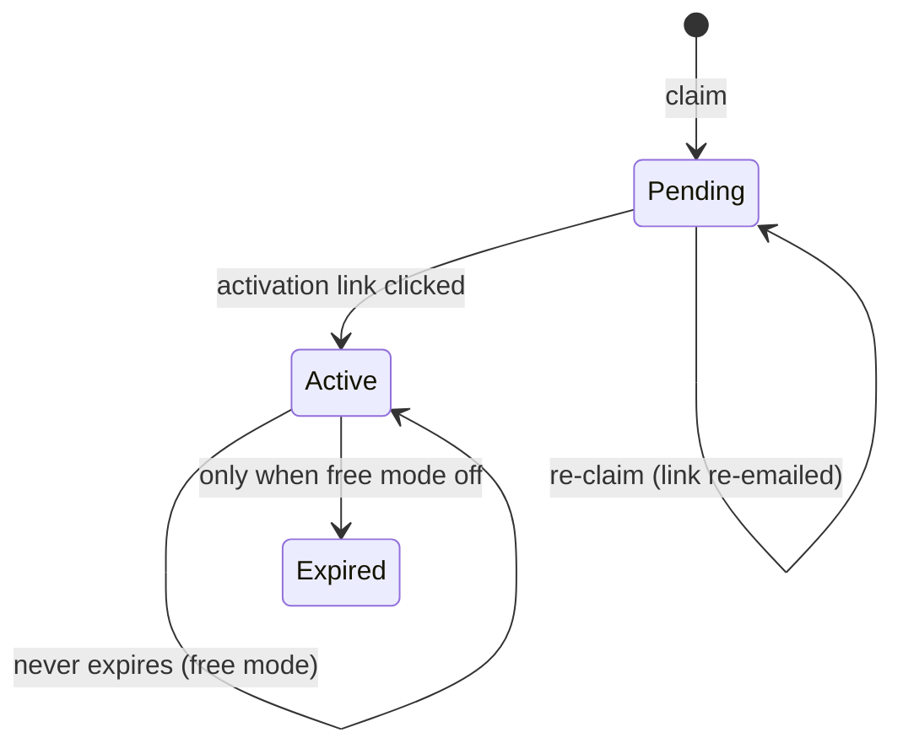
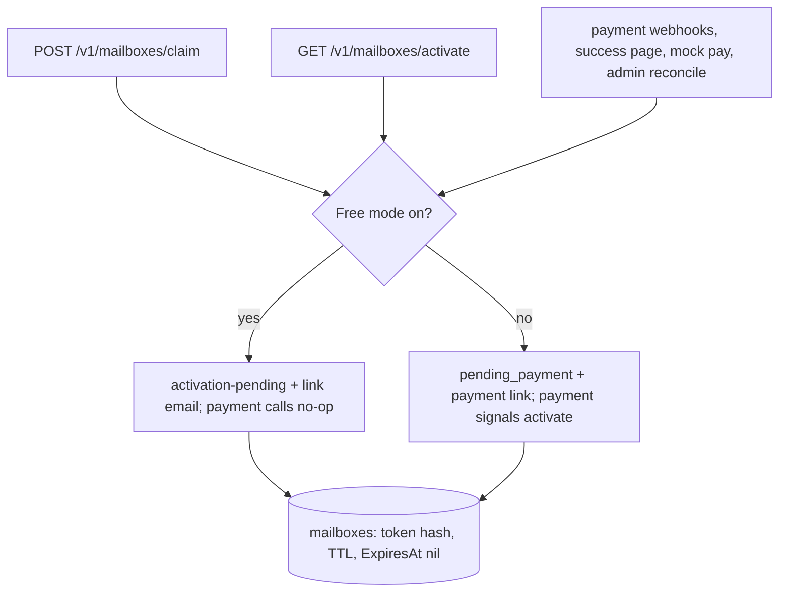

# Free Mode Mailbox Service - Plan

## Goal Capsule

- **Objective:** Make the mailbox service free while payment is disabled: claiming activates via an email link instead of a payment, activated mailboxes never expire, and payment rails stay dormant behind a default-on config gate for later re-enablement.
- **Product authority:** Operator (product owner). Product boundary unchanged: inbound email + IMAP read access only.
- **Execution profile:** Standard code change across the service layer, config, one migration, and served docs; six implementation units.
- **Stop conditions:** All U-IDs complete with their test scenarios passing; `go test ./...` and `go vet ./...` green; the served agent-API doc no longer instructs agents to pay.
- **Tail ownership:** The autonomous pipeline owns execution through the PR; the operator owns the external switchover action (provider subscription cancellation) at deploy time.
- **Open blockers:** None.

---

## Product Contract

### Summary

A config-gated free mode, default on, makes claiming payment-free: the claim email carries an activation link instead of a payment link, and activation grants an indefinite mailbox. Payment rails, coupons, webhooks, and expiry machinery stay dormant in the codebase for easy re-enablement; at switchover existing paid mailboxes keep working with billing stopped, and never-paid pending mailboxes get re-emailed activation links.

### Problem Frame

Every mailbox claim today gates on payment. `ClaimMailbox` always creates a payment link, stores the mailbox as `pending_payment`, and emails the link; only a payment signal — Polar or Stripe webhook, Polar success page, mock pay, or admin reconcile — flips it to `active` with a one-month grant, after which a five-minute expiry sweep and resolve-time gating kill it. The operator wants the service free for now, so the payment barrier must disappear without a rewrite that makes billing hard to restore later.

### Key Decisions

- **Free mode is a default-on config gate; payment code stays dormant.** (session-settled: user-directed — chosen over removing payment code outright: "for now" implies reversal, and a gate is far cheaper than a rewrite.) Governs R1, R5, R9.
- **Owner activation via email link replaces the payment link.** (session-settled: user-directed — chosen over auto-activation on first resolve: keeps today's claim-to-activate step and owner intent.) Governs R2, R3.
- **Activated free mailboxes never expire.** (session-settled: user-directed — chosen over fixed grants with expiry: matches the durable-identity promise of the product.) Governs R4.
- **Existing paid mailboxes keep working: billing stops, expiry clears.** (session-settled: user-directed — chosen over leaving them billing until lapse: no service interruption, no continued charges.) Governs R6.
- **Existing pending mailboxes convert and get re-emailed activation links.** (session-settled: user-directed — chosen over auto-activating or leaving them stale: owners who already claimed can still activate.) Governs R7.
- **Gift coupons are disabled entirely.** (session-settled: user-directed — chosen over accept-but-ignore: a coupon granting free months is redundant when everything is free.) Governs R9.
- **The legacy account/token flow goes free the same way.** (session-settled: user-directed — chosen over leaving legacy billing intact: one consistent free behavior.) Governs R8.
- **No dormant payment handler may bill or expire a mailbox in free mode.** (session-settled: user-approved — surfaced in the scope synthesis: cancelling provider subscriptions can fire lifecycle webhooks that today expire mailboxes.) Governs R5.

### Requirements

**Free mode gating**

- R1. A config switch, default on, selects free mode; when on, the service never consults a payment provider and requires no payment configuration. Turning it off restores today's paid behavior without code changes.
- R2. In free mode, claiming a mailbox never creates a payment link, never emails a payment link, and never calls a payment provider; the claim email carries an activation link instead.

**Activation and lifecycle**

- R3. A claimed mailbox stays pending until the owner clicks its activation link; clicking activates it. Re-claiming an existing pending mailbox regenerates and re-emails its activation link.
- R4. Activated mailboxes never expire: activation sets no expiry, the expiry sweep must not expire free mailboxes, and resolve/read gating must not reject them. Existing mailboxes get their expiry cleared at switchover.
- R5. In free mode, no dormant payment path can bill a mailbox or flip it to expired: revocation, renewal, and expiry webhook handling and the expiry sweep are inert while the gate is on.

**Switchover and existing data**

- R6. At switchover, existing active mailboxes keep working: billing stops (provider subscriptions cancelled), expiry is cleared, no re-activation required.
- R7. At switchover, existing pending (never-paid) mailboxes convert to activation-pending and receive a re-email with an activation link.
- R8. Legacy account/token mailbox creation follows the same free behavior: no payment step and no expiry, matching the key-bound flow; account subscription state stops gating mailbox usability while free mode is on.

**Coupons and compatibility**

- R9. Gift coupon handling is removed from the claim flow in free mode: coupons are not applied, validated, or emailed, and coupon errors do not occur. Coupon code and config stay dormant with the payment rails.
- R10. Claim API responses remain backward-compatible where feasible: the activation link substitutes for the payment link, and existing clients keep working.

### Key Flows

- F1. Claim and activate (free mode)
  - **Trigger:** Agent claims a mailbox with key proof.
  - **Steps:** Service verifies the key and dedups by fingerprint; creates an activation-pending mailbox; emails an activation link. Owner clicks the link; the service activates the mailbox with no expiry.
  - **Covered by:** R1, R2, R3, R4
- F2. Switchover (one-off, ops-run)
  - **Steps:** Existing active mailboxes: cancel provider subscriptions, clear expiry. Existing pending mailboxes: convert to activation-pending and re-email activation links.
  - **Covered by:** R5, R6, R7
- F3. Re-enable paid mode (later)
  - **Steps:** Flip the config gate off. Payment provider selection, webhooks, coupons, and expiry return to their current behavior without code changes.
  - **Covered by:** R1

### Acceptance Examples

- AE1. **Covers R1, R2, R3.** Given free mode is on, when an agent claims a mailbox, then no payment provider is called, the mailbox is pending, and the claim email contains an activation link and no payment link.
- AE2. **Covers R4.** Given a mailbox was activated, when its former grant window passes and the expiry sweep runs, then the mailbox stays usable.
- AE3. **Covers R6.** Given an active paid mailbox at switchover, when the switchover completes, then it remains usable, its provider subscription is cancelled, and it has no expiry.
- AE4. **Covers R7.** Given a pending mailbox at switchover, when the switchover completes, then it is activation-pending and its owner receives a fresh activation link; clicking it activates the mailbox.
- AE5. **Covers R5.** Given free mode is on, when a payment signal arrives through any surface — webhook (including subscription revoked), success page, mock pay, or admin reconcile — then no mailbox is expired or billed.
- AE6. **Covers R8.** Given a legacy account without an active subscription, when it creates a mailbox, then the mailbox is created free with no payment step and no expiry.
- AE7. **Covers R9.** Given free mode is on, when a claim includes a coupon code, then no coupon is applied and no coupon error is returned.

### Success Criteria

- Claim-to-active works with no payment step and no payment provider call.
- No mailbox expires or is billed while free mode is on — new or existing.
- Switchover completes with no interruption to existing active mailboxes.
- Re-enabling paid mode is a config change, not a code change.

### Scope Boundaries

- Deferred for later: refunds or proration for paid users; refreshing STRATEGY.md's paid narrative and paid-subscription metrics; permanently removing the dormant payment code; cleaning dormant payment env vars from deploy workflows; a future breaking rename of the `waiting_payment` status string and `payment_url` field to activation vocabulary once free mode has stabilized (the KTD5 compatibility choice is temporary).
- Outside this change: SMTP/outbound sending; identity or key-binding model changes; abuse and rate-limit hardening specific to free mode.
- Expired mailboxes at switchover are not revived; their owners can re-claim.

### Dependencies / Assumptions

- Cancelling existing provider subscriptions is an ops action needing Polar/Stripe credentials at switchover.
- `billing_email` stays required at claim — it carries the activation email.
- Re-emailing pending mailboxes is acceptable even if some owners never click; they stay pending, as today.
- Mailboxes activated under free mode are grandfathered when paid mode returns (see Planning Contract Assumptions).

### Sources / Research

- `internal/core/service/mailbox_service.go` — claim, activation, renewal, expiry sweep, resolve-time gating
- `internal/adapters/httpapi/handler.go` — webhook mappings (`subscription.revoked` to expiry, order/subscription events to renewal), Polar success page, mock pay, admin reconcile
- `cmd/app/main.go` — payment provider selection by env presence, expiry ticker, coupon enablement
- `internal/domain/mailbox.go` — statuses and `Usable()` gating
- `docs/polar-minimal-payments-spec.md` — current Polar slice spec
- `docs/plans/2026-03-12-001-feat-gift-coupon-codes-plan.md` — coupon system being disabled
- `STRATEGY.md` — paid-product framing that free mode temporarily suspends

---

## Planning Contract

**Product Contract preservation:** Product Contract unchanged. The brainstorm's Deferred-to-Planning questions were resolved here and land as KTDs and assumptions; AE5 wording was clarified to name all payment surfaces (consistent with R5, no scope change). Document review refined KTD3/KTD4 (expiry sweep gated, reconciling R5), KTD5 (status mapping and response mechanism), and unit-level implementation detail; no product-scope change.

### Key Technical Decisions

- KTD1. **Free-mode flag is an explicit env var defaulting on** — `FREE_MODE`, absent means on, `false` turns the gate off. It is not derived from payment-provider absence, so payment wiring stays built and dormant. (session-settled: user-directed — chosen over removing payment code outright: "for now" implies reversal, and a gate is far cheaper than a rewrite.) Governs R1, R5, R9. Optional-with-default avoids the required-var deploy crash documented in `docs/solutions/integration-issues/missing-edproof-hmac-secret-in-smoke-deploy.md` and mirrors the env-presence gate precedent in `docs/solutions/security-issues/ed25519-challenge-response-auth.md`.
- KTD2. **Activation links mirror the recovery-code pattern:** URL-safe random token from the existing secure generator, pinned at 16 bytes (128 bits) — not the 12-byte recovery-code size — sha256 hash stored on the mailbox row, one-time use, fixed 24-hour TTL, idempotent activation. Re-claim regenerates and re-emails. Governs R3. Hash-at-rest keeps credential parity with every other secret in the repo.
- KTD3. **Free activation reuses the paid-activation shape with `ExpiresAt` left nil:** sets `PaidAt` so `Usable()` holds, never sets expiry, provisions the mailbox. The expiry sweep is gated off in free mode rather than relying on nil-expiry rows being naturally skipped, because existing active mailboxes still carry non-nil `ExpiresAt` between deploy and switchover. Governs R4.
- KTD4. **Dormant payment and expiry paths are gated at the service layer:** `MarkMailboxPaid`, `RenewMailbox`, `ExpireMailboxByID`, `ReconcilePendingPayments`, `ExpireMailboxes`, and the resolve-time stale active-to-expired flip refuse or no-op while free mode is on; routes and handlers stay registered and return inert responses. (session-settled: user-approved — surfaced in the scope synthesis: cancelling provider subscriptions can fire lifecycle webhooks that today expire mailboxes.) Governs R5.
- KTD5. **Claim responses keep the `payment_url` field and status strings unchanged**, with `payment_url` carrying the activation URL in free mode; the service builds that URL from the freshly generated token and returns it through the claim result, and the handler puts it in `payment_url` without persisting the token or URL. The stored mailbox status stays `pending_payment` and the emitted resolve string stays `waiting_payment`; "activation-pending" is the descriptive label for that state, not a new status value. Governs R10.
- KTD6. **Switchover is an admin-gated one-off** behind the existing admin-key guard that clears `ExpiresAt` on active mailboxes, clears account `SubscriptionExpiresAt`, and converts pending mailboxes to activation-pending with a fresh token and re-email. Deploy ordering: gate on, then cancel provider subscriptions, then run switchover, so cancellation webhooks are inert. Governs R6, R7.

### High-Level Technical Design

The free-mode gate lives in the service layer, between every external surface and the mailbox lifecycle. Payment surfaces stay reachable but inert; claim and activation are the only live entry points.

### Assumptions

- `FREE_MODE` is optional with a default of on; no deploy-workflow env change is required to ship.
- Re-enabling paid mode grandfathers free-activated mailboxes: they keep nil expiry forever, and only new activations receive paid-mode grants. The grandfather rule covers account-bound mailboxes too: at re-enable, the account-subscription gate is bypassed for mailboxes whose own `ExpiresAt` is nil.
- The activation-link TTL is a single constant defaulting to 24 hours; making it configurable later is a config change, not a design change.
- The pre-existing claim race (`GetByKeyFingerprint` then create, non-atomic) is out of scope; implementation verifies the `key_fingerprint` uniqueness constraint exists.
- No new Go dependencies are introduced, so no `flake.nix` `vendorHash` change is needed.

### Open Questions

- **Deferred to Implementation:** the exact activation TTL value (24-hour constant default); whether already-expired mailboxes receive a re-claim nudge email at switchover (default: no).

---

## Implementation Units

### U1. Free-mode config gate

- **Goal:** Introduce the `FREE_MODE` config flag, default on, and thread it into service and handler construction.
- **Requirements:** R1
- **Dependencies:** none
- **Files:** `internal/platform/config/config.go`, `internal/platform/config/config_test.go`, `cmd/app/main.go`, `.env.example`
- **Approach:** Add a bool env helper (absent or invalid → default true) and a `Config.FreeMode` field; pass the resolved value into `MailboxService` and the HTTP handler. Provider selection in `cmd/app/main.go` stays untouched — payment wiring remains built but dormant.
- **Patterns to follow:** env-helper style in `internal/platform/config/config.go`; optional-with-default per `docs/solutions/integration-issues/missing-edproof-hmac-secret-in-smoke-deploy.md`; env-presence mode gating precedent in `docs/solutions/security-issues/ed25519-challenge-response-auth.md`.
- **Test scenarios:**
  - `Load()` with `FREE_MODE` unset → `FreeMode` is true.
  - `Load()` with `FREE_MODE=false` → false.
  - `Load()` with `FREE_MODE=garbage` → true (default on invalid input).
- **Verification:** `go test ./internal/platform/config`; `go build ./...`.

### U2. Activation-link token and email

- **Goal:** Add activation-token storage and a `SendActivationLink` notifier method across all adapters, following the recovery-code pattern and HTML-escape discipline.
- **Requirements:** R3
- **Dependencies:** U1
- **Files:** new migration `internal/platform/database/migrations/<ts>_add_mailbox_activation_token.sql`, `internal/adapters/repository/mailbox_gorm.go`, `internal/adapters/repository/mailbox_gorm_test.go`, `internal/domain/mailbox.go`, `internal/core/ports/ports.go`, `internal/adapters/notify/{log,mailgun,resend,sendgrid,unsend}_notifier.go`, `internal/core/service/mailbox_service_test.go`
- **Approach:** Add nullable `activation_token_hash` and `activation_expires_at` columns to `mailboxes` (mirror the `expires_at` migration). `activation_expires_at` is the activation token's own TTL, distinct from the mailbox `ExpiresAt`, which free activation leaves nil (U3). Add repository methods to find a pending mailbox by token hash and mark the token used. Add `Notifier.SendActivationLink(ctx, ownerEmail, activationURL, mailboxID)` implemented by all five adapters; HTML bodies escape the URL and mailbox ID with `html.EscapeString` per the existing senders (see `docs/solutions/security-issues/p2-auth-body-limit-html-escaping.md`). Tokens come from the existing secure generator (URL-safe base64) at 16 bytes (KTD2).
- **Test scenarios:**
  - Migration up/down apply cleanly on a temp SQLite DB.
  - Repository: save hash, find by hash, mark used, no match on unknown hash.
  - Notifier: mailgun body contains the escaped URL and mailbox ID; plain-text adapters render the link; the interface change compiles across all five adapters and the log notifier.
- **Verification:** `go test ./internal/adapters/repository ./internal/adapters/notify`.

### U3. Free-mode claim, activation, and legacy flow

- **Goal:** Free-mode claim path (skip payment and coupons, email an activation link), the activation endpoint, legacy `CreateMailbox` free behavior, subscription-gate bypass, and response compatibility.
- **Requirements:** R2, R3, R8, R9, R10
- **Dependencies:** U1, U2
- **Files:** `internal/core/service/mailbox_service.go`, `internal/core/service/mailbox_service_test.go`, `internal/adapters/httpapi/handler.go`, `internal/adapters/httpapi/handler_test.go`
- **Approach:** In free mode, `ClaimMailbox` treats `couponCode` as empty at entry, which neutralizes both `validateCoupon` and the coupon-redeemed dedup branch; it then skips payment-link creation and `SendPaymentLink`, generates an activation token, stores its hash plus TTL, and emails `SendActivationLink`. The stored status stays `pending_payment` and the emitted resolve string stays `waiting_payment` (KTD5). The service builds the activation URL from the fresh token and returns it through the claim result; the handler puts it in `payment_url` without persisting the token or URL (KTD5). The re-claim branch is re-keyed off free mode rather than payment-session presence and regenerates the token. A new activation endpoint (mirroring the recovery-complete handler) validates hash, TTL, and one-time use, then activates: `Status=Active`, `PaidAt=now`, `ExpiresAt=nil`, provision. The endpoint sets `Referrer-Policy: no-referrer`, never renders or echoes the raw token in its response body, and logs only the hash. An expired or already-used token on a still-pending mailbox returns a page naming the recovery path: re-claim with the same key to regenerate the link. Already-active clicks are idempotent. Legacy `CreateMailbox` in free mode produces an activation-pending mailbox with an emailed link instead of the subscription branch; `validateMailboxSubscription` bypasses the account gate while free mode is on.
- **Execution note:** Write failing service tests for the free-mode branches first (extend the existing `TestClaimMailbox*` suite), then wire the behavior.
- **Test scenarios:**
  - Covers AE1: claim in free mode calls no payment gateway, returns pending, emails an activation link, response carries an activation URL in `payment_url`.
  - Covers AE7: claim with a coupon code in free mode applies nothing and returns no coupon error.
  - Re-claim of a pending mailbox regenerates the token and re-emails; the old token no longer activates.
  - Clicking a valid activation link activates the mailbox with no expiry; resolve then works (Covers AE2).
  - Expired token, already-used token, and unknown token all fail without side effects.
  - Second click on an active mailbox is idempotent.
  - Covers AE6: legacy account mailbox creation in free mode produces an activation-pending mailbox with no payment step.
  - Resolve after the old account deadline still succeeds for account-bound mailboxes (gate bypass).
  - Re-claim of an already-expired mailbox in free mode regenerates the activation token and re-emails instead of touching the payment gateway.
  - At re-enable (free mode off), an account-bound mailbox activated under free mode keeps working: its nil `ExpiresAt` bypasses the account-subscription gate (grandfather rule).
- **Verification:** `go test ./internal/core/service ./internal/adapters/httpapi`.

### U4. Dormant payment-surface gating

- **Goal:** While free mode is on, no payment signal can bill or expire a mailbox.
- **Requirements:** R5
- **Dependencies:** U1
- **Files:** `internal/core/service/mailbox_service.go`, `internal/core/service/mailbox_service_test.go`, `internal/adapters/httpapi/handler.go`, `internal/adapters/httpapi/handler_test.go`
- **Approach:** Gate `MarkMailboxPaid`, `RenewMailbox`, `ExpireMailboxByID`, `ReconcilePendingPayments`, `ExpireMailboxes`, and the resolve-time stale active-to-expired flip at the service layer to refuse or no-op while free mode is on (single check, KTD4). Webhook, Polar-success, mock-pay, and reconcile handlers stay registered but return inert responses.
- **Test scenarios:**
  - Covers AE5: a `subscription.revoked` webhook in free mode leaves the mailbox active.
  - An order or subscription renewal event in free mode does not extend or alter the mailbox.
  - Admin reconcile in free mode reports no activations and touches no rows.
  - Mock-pay in free mode does not activate.
  - The five-minute expiry sweep in free mode flips no rows, including during the deploy-to-switchover window.
- **Verification:** `go test ./internal/core/service ./internal/adapters/httpapi`.

### U5. Switchover support

- **Goal:** Admin-gated one-off transition of existing data to the free model.
- **Requirements:** R6, R7
- **Dependencies:** U1, U2, U3, U4
- **Files:** `internal/core/service/mailbox_service.go`, `internal/core/service/mailbox_service_test.go`, `internal/adapters/httpapi/handler.go`, `internal/adapters/httpapi/handler_test.go`, `internal/adapters/repository/mailbox_gorm.go`, `internal/adapters/repository/account_gorm.go`
- **Approach:** An admin-key-gated switchover operation (pattern: existing `/admin/*` handlers) that, only while free mode is on, clears `ExpiresAt` on active mailboxes, clears account `SubscriptionExpiresAt`, and converts pending mailboxes to activation-pending with a fresh token and re-email. Idempotent. Deploy ordering (operator): gate on, then cancel provider subscriptions, then run switchover (KTD6). The gate-on step requires U4's service-layer gating to be deployed first.
- **Execution note:** Run against a prod DB copy first; the re-email step sends to real owners.
- **Test scenarios:**
  - Covers AE3: an active mailbox ends with nil expiry and stays usable.
  - Covers AE4: a pending mailbox gains a working activation link via re-email and activates on click.
  - Account-bound active mailboxes survive past their old account deadline.
  - Already-expired mailboxes are untouched.
  - Re-running the switchover is a no-op.
- **Verification:** `go test ./internal/core/service ./internal/adapters/httpapi ./internal/adapters/repository`.

### U6. Documentation update

- **Goal:** Update the served agent-API doc and env reference so free-mode behavior is what new agents read.
- **Requirements:** R10
- **Dependencies:** U3
- **Files:** `docs/agent-api-skill.md`
- **Approach:** Replace payment instructions with activation-link instructions (the `payment_url` and `status: expired` guidance in `docs/agent-api-skill.md`), and state that status strings and field names are unchanged for compatibility (KTD5).
- **Test expectation:** none — docs-only change.

---

## Verification Contract

- `go test ./...` — full suite across all units.
- `go test -count=1 ./...` — disable the test cache while iterating.
- `go vet ./...` — static checks.
- `gofmt -w` on all changed Go files.
- Targeted while developing: `go test ./internal/core/service -run 'TestClaimMailbox|TestActivate|TestSwitchover|TestFreeMode'`.

## Definition of Done

- Every unit U1–U6 is complete with its test scenarios passing.
- Requirements R1–R10 hold in the running service in free mode.
- `go test ./...` and `go vet ./...` pass with no failures.
- The served `docs/agent-api-skill.md` no longer instructs agents to pay or present a payment URL as a payment step.
- No dead or experimental code remains from abandoned approaches.
- `.env.example` documents `FREE_MODE`.

---

## System-Wide Impact

- Data lifecycle: `ExpiresAt` becomes nil for free-activated and switchover-cleared mailboxes; the expiry sweep skips them.
- Config surface: new optional `FREE_MODE` env var; payment env vars become dormant, not removed.
- API contract: `payment_url` and the `waiting_payment` status string keep their names with activation semantics (KTD5).
- Served documentation: `docs/agent-api-skill.md` changes what new agents read.

## Risks & Dependencies

- Provider cancellation webhooks can expire permanent mailboxes — mitigated by service-layer gating (U4) and deploy ordering (U5).
- Activation-token leakage — mitigated by hash-at-rest, one-time use, and the 24-hour TTL (U2).
- Re-enable semantics for free mailboxes — grandfathering assumption (Planning Contract).
- No new Go dependencies; no `flake.nix` vendor hash change.
